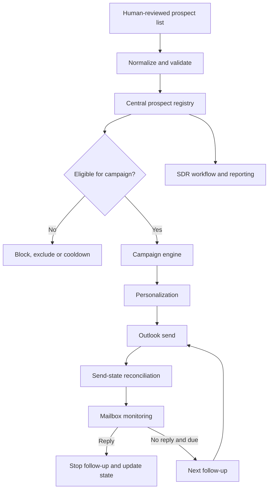

# Sales Automation

**Controlled multi-campaign B2B sales automation workflow**

Sales Automation is a workflow built to automate repetitive outbound-sales operations without losing control of prospect ownership, campaign collisions, timing or reply state. The key design problem is not sending email. It is coordinating multiple campaigns safely around the same prospect registry.

> Portfolio note: this repository documents a sanitized version of a working internal workflow. Real prospects, company data, email addresses, campaign content, attachments, credentials and operational databases are intentionally excluded.

## Why I built it

Running several prospecting campaigns creates operational risks: the same person can appear in multiple lists, a prospect can be contacted again after replying, follow-ups can collide with another campaign, and uncertain send states can create duplicate messages.

I designed the system around a central registry and explicit state transitions so automation remains subordinate to commercial rules.

## Workflow

## What the implementation covers

- a central registry shared across campaigns
- normalized prospect identity and campaign state
- campaign eligibility decisions before outreach
- exclusion and cooldown concepts
- creation of an email campaign from a validated campaign
- local campaign persistence
- personalized message rendering
- timing and due logic for campaign steps
- Outlook integration for outbound communication
- orchestration of campaign cycles
- an SDR agent/application layer for managing the workflow

## Product principles

**One prospect, one coordinated history.** Campaigns should not behave as isolated spreadsheets. A shared registry provides one place to decide whether a prospect can be contacted.

**Human-reviewed inputs.** Automation begins after the prospect list has been reviewed. Account ownership, colleague exclusions and relationship context remain human-controlled.

**Prevent collisions before optimizing throughput.** Avoiding duplicate or contradictory outreach is more important than maximizing send volume.

**State before action.** Prospect status, campaign status and timing are checked before a message becomes due.

**Prefer uncertainty over duplicate outreach.** When state cannot be safely established, the workflow should not blindly create another external action.

## Architecture

The project is a local Python workflow with two principal layers: a campaign engine and an SDR/registry layer. The campaign engine manages contacts, persistence, personalization, due logic and Outlook cycles. The SDR layer centralizes campaign/prospect decisions and coordinates validated campaigns.

See [Architecture](docs/ARCHITECTURE.md), [Business & Product Decisions](docs/BUSINESS_PRODUCT_DECISIONS.md) and [Security](SECURITY.md).

## My role

I defined the commercial problem, cross-campaign constraints, lead-control rules, desired cadence and operating workflow, and iteratively built the prototype with AI-assisted development. I tested it against the operational problems I wanted to solve: duplicate outreach, campaign overlap, follow-up timing and maintaining human control over prospect lists.

This project is presented as hands-on business-process automation and AI-assisted solution prototyping, not as conventional solo software engineering.

## Limitations

- Outlook automation depends on the local Microsoft/Windows environment used by the operational version
- campaign rules require configuration for each use case
- reply/state matching can require human review in ambiguous situations
- outreach compliance and internal commercial rules remain organizational responsibilities
- the portfolio repository contains no real prospect data or production credentials

## Portfolio status

The original workflow remains private and operationally separate. The GitHub version is being prepared as a sanitized portfolio representation.

## Portfolio walkthrough

The portfolio presentation focuses on the operational campaign interface: campaign selection, human-reviewed CSV import, exclusions, contact state, sequence configuration, timing controls and Outlook integration. Personal email addresses are masked in screenshots.

## What to discuss in an interview

The interesting problem is not bulk email generation. It is coordinating state across campaigns so that automation respects prospect ownership, exclusions, replies, cooldowns and follow-up timing. The system therefore prioritizes a shared registry and explicit eligibility decisions over raw sending volume.
