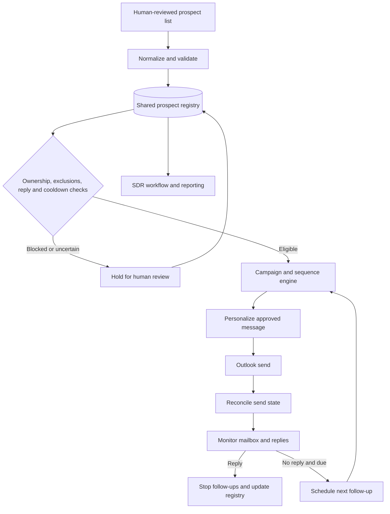

# Sales Automation — Architecture

This diagram shows how campaign state and prospect controls govern outbound communication.

## Boundaries and controls

- Prospect inputs are reviewed by a person before campaign processing.
- The shared registry is the source of truth for ownership, exclusions, replies and timing.
- Uncertain send state or prospect state should be held for review to reduce duplicate outreach.
- The portfolio snapshot contains no live prospect lists, business contact details, campaign attachments, credentials, operational databases or message history.

## Components

The Python implementation separates campaign configuration and cadence, prospect normalization and persistence, eligibility decisions, message personalization, Outlook integration, cycle orchestration and SDR-facing workflow/reporting. The exact integrations depend on the operational Windows and Microsoft environment.
